# Maxim's Portfolio
Portfolio of various data-oriented projects!

# [Project 1: Formula-1-Analysis](https://github.com/mguzman123/Formula-1-Analysis)

## Background
Formula 1 (aka F1) is an international racing series that currently involves ten different teams, each with two drivers. The number of teams has varied across the years since Formula 1 started in 1950. Some of the teams, called "constructors", are familiar to the general population through their production of commercial cars. These include Ferrari, Mercedes, McLaren, and Renault. Each race is known as a Grand Prix and the location of these races have changed (and will continue to change) over time. 

Determining the winner of the annual series works through a point system, with the current system awarding points to the top 10 drivers; the closer to first you finish, the more points you receive. It is important to note that the point system has changed since 1950; regardless, the driver with the most points at the end of the season is the world champion. There is also the competition for best constructor, which is awarded to the team who has scored the most points at the end of the season. 

The structure of a F1 weekend is as follows. First is Friday practice where each team has two 90-minute slots to familiarize themself with the track. On Saturday, the third and final practice session takes place in the morning for an hour and this is followed by qualifying in the afternoon. This session lasts about an hour and is split into 3 sessions: Q1, Q2, Q3. In the first qualifying session (Q1), all 20 drivers race on the track at the same time and the five slowest drivers are eliminated. They fill positions 16-20 In Q2, the remaining 15 cars all race simultaneously and the slowest 5 cars are once again eliminated. These 5 drivers take positions 15-11. Finally, in Q3, the remaining 10 drivers compete for pole (first) position and the fastest driver takes this position. They will start in first place on the grid when the race starts the following day. Sunday is the day of the actual race where all drivers compete for podiums (top 3 placement). You can read more about the Grand Prix format [here](https://www.tutorialspoint.com/formula_one/formula_one_grand_prix_format.htm).

## Project Overview
In this project, we take a look at the 2007 season and focus on a single constructor: McLaren. The two drivers in this year were Lewis Hamilton (from the UK) and Fernando Alonso (from Spain). We take the point of view as a potential sponsor for one of the drivers in the 2008 season and want to decide which would be the best to choose. Alonso has outperformed many of his teammates throughout his career and performed exceptionally well, even when driving poorly-engineered cars. Hamilton is also considered to be one of the most talented drivers and currently ties Michael Schumacher for the most world champions in F1 history and wanted to see how he performed in his roookie year.

To select which driver to sponsor, we look at different metrics that measure each drivers' performance in the 2007 season to determine who drove at a higher level/has the most potential and therefore who we want to sponsor in 2008. We want to select the best performing individual in order to maximize our ROI since the better driver will gain more exposure and maximize the visibility of our brand. This [article](https://drivetribe.com/p/who-benefits-the-most-from-f1-sponsorship-QjpzASLyTl6D-sfxRsiSkw?iid=Ht3q7xAnRPOjuRcfGCIuoA) provides more in-depth background on sponsorship in F1.

I obtained this data from Kaggle, which can be found [here.](https://www.kaggle.com/rohanrao/formula-1-world-championship-1950-2020)

__Disclaimer__: If this was a real-life situation where a lot of money was at stake, we would want to look beyond just one season in order to account for any anomalies that occur in a single season. However, we are limited to only one year of Lewis Hamilton's data since this is his first year.

## Data Cleaning

This mostly consisted of flagging outliers, setting place holders for missing values, checking consistency between related variables, and renaming columns. After the files were cleaned, I used SQL to join relevant fields from different tables and then made some final changes, which can be seen in the first four notebooks.

## Summary of Analysis

Below is a high-level summary of the analysis conducted to choose the driver to sponsor. The __complete analysis__ can be found in [this notebook](https://github.com/mguzman123/Formula-1-Analysis/blob/main/notebooks/05_01_hamilton_alonso_analyze.ipynb).

### Age in Formula 1 

Alonso is older than Hamilton and 2007 was Hamilton's rookie season, so it's not exactly an apples to apples comparison. Still, it is useful to look at the relationship between age and performance.

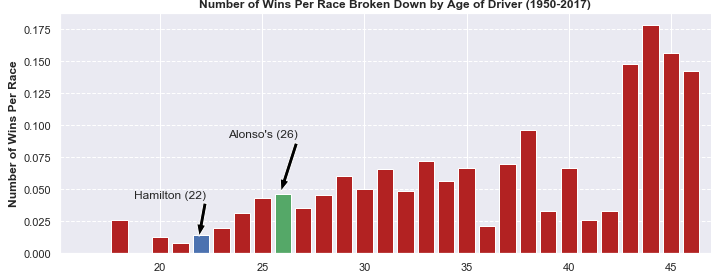

### Qualifying/Grid Positioning 

To assess who performs better in qualifying, we can observe their starting grid positions. As we touched upon before, qualifying directly influences a drivers grid positioning. A driver will have outperformed his teammate in this section if they begin ahead of them. Our choice of who to sponsor will take into account whether Hamilton or Alonso has better qualifying laps and a higher grid position. 

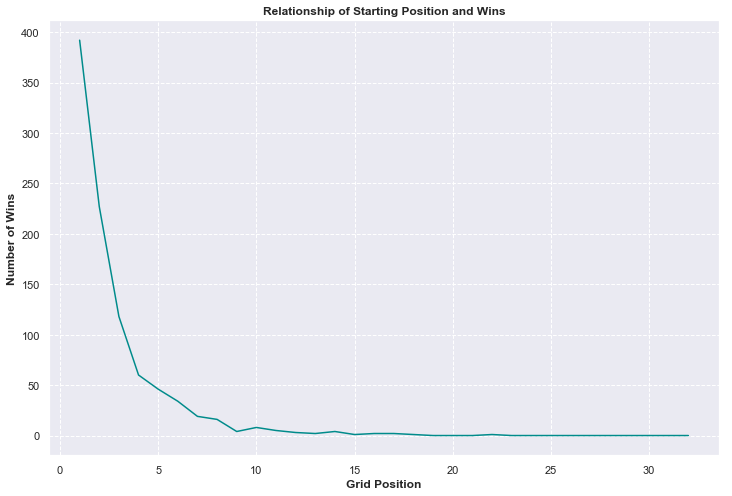

We can see from the graph above that, since grid positioning is directly influenced by qualifying, that the better one qualifies, the better they'll finish at the end of the race. This highlights the significance of qualifying well.

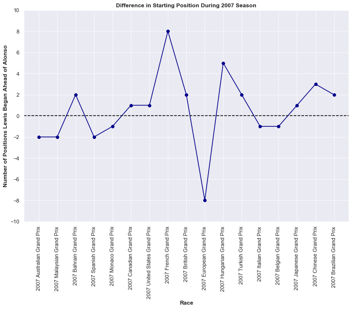

Alonso and Hamilton always started in the top 10, meaning they always had a chance to fight for a podium position (the [complete notebook](https://github.com/mguzman123/Formula-1-Analysis/blob/main/notebooks/05_01_hamilton_alonso_analyze.ipynb) goes into detail about the events leading up to grid positioning). Furthermore, with the exception of two races, Alonso was always began in the top 5. Meanwhile, Hamilton started in the top 5 all but one time. The farther up the grid you are, the more significant a position difference is when it comes to winning. Therefore, any time one McLaren driver begins ahead of the other is very significant.

Overall, throughout the course of the season, Hamilton started 10 positions ahead of Alonso. Showing that, while both drivers are very fast, Hamilton is slightly, and critically, able to edge out Alonso in the end.

### Lap by Lap Consistency in Race

Here, we're gonna focus on how often a driver deviates from his position on a lap-by-lap basis. We'll specifically be looking at the standard deviation of their positioning throughout each race. Basically, the smaller the standard deviation, the less their position varied, which is what we want. Since the two McLaren drivers (nearly) always began toward the front of the pack, they only have a few positions to gain while having many positions to lose. This means that even if they improve and move towards podium/pole position, this will likely be a small change from their initial positioning, while them potentially dropping down over 10 positions will be a large contrast. The latter will produce larger standard deviations.

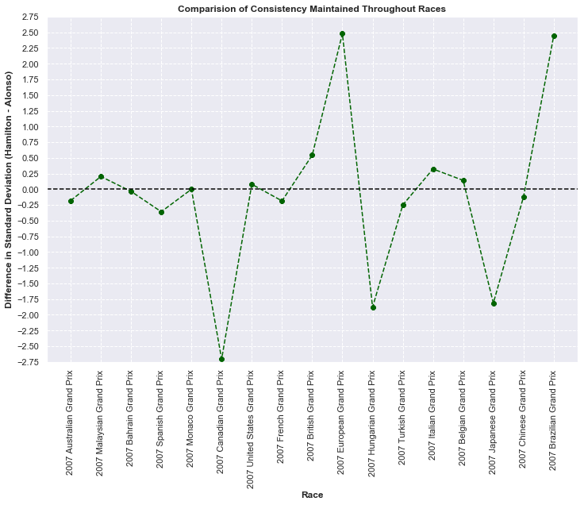

Looking at the standard deviation visualization, we can see that Hamilton has more consistent lap positions in 9 out of 17 races, the majority. Meanwhile, Alonso had a smaller standard deviation in 7 out of 17 races. There were some events (explained in the [full notebook](https://github.com/mguzman123/Formula-1-Analysis/blob/main/notebooks/05_01_hamilton_alonso_analyze.ipynb) ) that affected each drivers' lap in various races. To quickly summarize, Alonso faced issues that are more connected to his driving while Hamilton encountered adversity outside of his control. As a result, this paints Hamilton as the more proficient driver and, once again, Hamilton is a more favorable choice to potential sponsors.

### Driver Performance Capabilities

This next section explores how much performance each driver can extract from the car. The two vehicles are identical from an engineering standpoint and any differences in speed therefore comes from the skill of the driver itself. This is a great way for a sponsor to get an idea of which driver is superior. Here, we'll explore each drivers' top speeds and lap times. Clearly, faster lap speeds and shorter lap times indicates more innate skill in the driver.

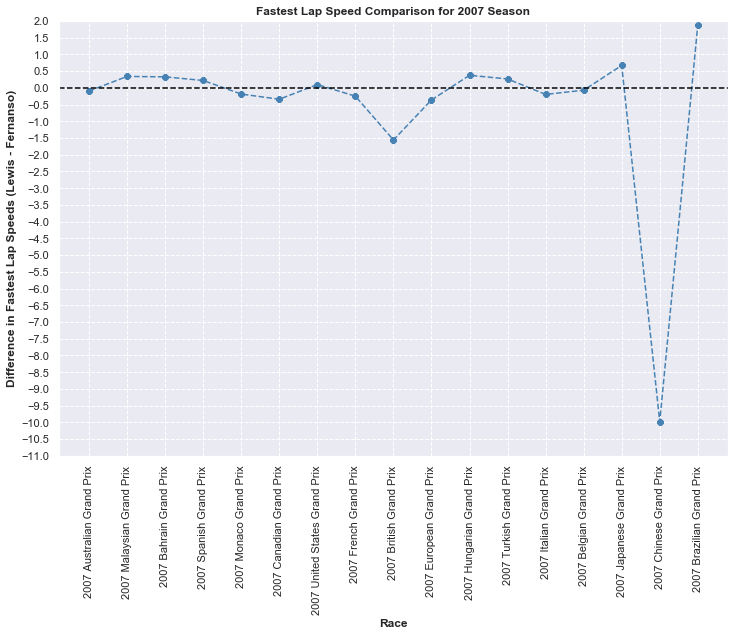

Alonso barely defeats Hamilton in the fastest lap speed criteria, where he was able to push the car faster than Hamilton in 9 out of 17 races. However, with the exception of a few races, the drivers were neck-and-neck, usually within half a km/hr of each other. In the Chinese Grand Prix, Hamilton actually faced some tire and pit stop issues and had to retire from the race. This can help explain the great discrepancy in speed here, which isn't totally due to the driving of Hamilton. Overall, Alonso was faster by about 4.6 km/hr throughout the whole season.

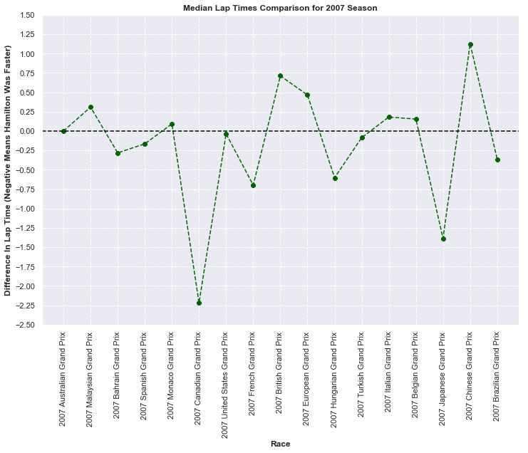

Both Hamilton and Alonso have equivalent median lap times for the first race of the season. Beyond that, Hamilton has a quicker median lap time in 9 out of 16 races. Furthermore, overall, the net difference favors Hamilton by about 2.8 seconds. It does appear that, for the most part, when Hamilton is faster than Alonso he's significantly faster. In contrast, Alonso rarely dusts his teammates when he is the quicker driver.

It seems that each driver had an opportunity to shine in each category and puts them head-to-head in pure driving skill.

### End of Race Wins, Podiums, and Points

Somehow, both Hamilton and Alonso had identical stats in terms of number of wins, podiums, and points. However, we can run a more in-depth analysis to extract and subtle distinctions.

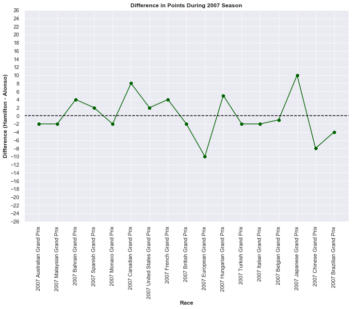

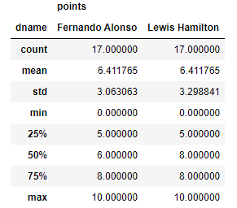

Out of the 10 races Alonso finished ahead of Hamilton, he managed to make the margin over 2 points in 3 of the races. We'll take a closer look in the next section but this meant Alonso only finished a single, at most two, position(s) ahead of Hamilton - usually 1st vs 2nd/2nd vs 3rd. In contrast, Hamilton had 5 occasions where he scored over two points than Alonso in the 7 races he finished better. This means that while Hamilton was less frequent in winning more points, he was able to outperform Alonso to a greater extent.

Overall, Alonso seems to be a bit more of a skilled driver in terms of points won as he outperformed Hamilton more often; and that paired with the smaller variation in points displays him as a more dependable driver. However, we mustn't discount Hamilton's ability to stand out more when he does dominate.

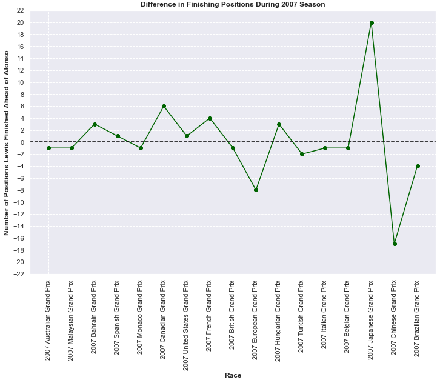

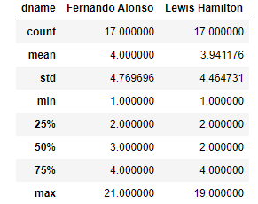

When it comes to final positioning, we can see that Alonso, again, finished ahead of Hamilton 10 times. This is consistent with what we saw in terms of how often Alonso scored more points than Hamilton. 

However, Hamilton puts up some more favorable statistics here. On average, he finished closer to pole position than Alonso, though barely. Hamilton's median position was one ahead of Alonso's and he actually deviated less in ending positioning too. Accounting for the two unfortunate races each driver faced where they finished far outside the top 10, Hamilton tended to finish one position ahead of Alonso as we look at the median. Also, across all the races, Hamilton finished one position ahead of Alonso, displaying dominance in this metric.

Finally, we can measure the skill of these drivers by seeing how much they improved/declined from the start of the race to the end of the race. To do this, we look at where they finished compared to where they began on the grid. This displays the drivers ability to battle others for better positioning and also their skill in defending their current position.

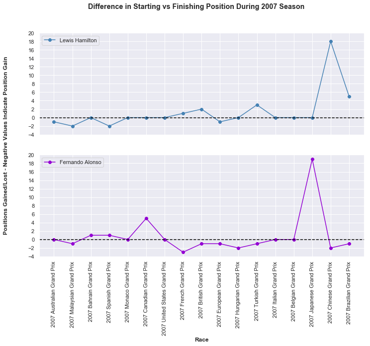

Since both McLaren drivers tended to start towards the front of the pack, they only have a few positions to gain while many positions to lose. Hamilton started at pole position 6 different times and was able to finish first as well in 4 of these races. One of the two races where he failed to finish first was in China where he was forced to retire. 

While it seems that Alonso is more skilled in battling other drivers for positioning, he started the race behind Hamilton in 6 of the 8 instances he did gain positioning. Also, out of these 8 races, he started in 4th place 3 times, 6th place once, 10th place one, and finally 2nd place once. Meaning, he typically had a few drivers from the very beginning ahead of him, allowing for improvement. 

Overall, Hamilton was better in maintaining the same position he held when the race begun. Alonso, on the other hand, shows his ability to improve positioning when starting farther back. Given the context of grid positioning, Hamilton's statistics in this case are more impressive since he already is starting towards the front and the graph shows very little change, which is what we want for drivers in his case.

### Final Comparison

Hamilton outperformed Alonso in qualifying, grid positioning, driving consistency, lap time performance, final positioning, and maintaining dominant positioning throughout a race. Alonso was supeior in lap speed performance and points earned.
### Sponorship Choice

Even though Hamilton was the better driver more often, we have to remember it was never a landslide. Furthermore, while it's very difficult to come with exact numbers, each criterion don't carry the same weights. For instance, Alonso's ability to gain more positions throughout a race is probably more valued than Hamilton's ability to defend his position. Finally, as we touched on before, we don't have a robust amount of data; ideally we have more data points to analyze to come to a more solidified conclusion.

However, we do have to remember that this is Hamlton's rookie season while Alonso has been around for a few years. We saw that drivers do tend to perform better with more experience.

Therefore, Hamilton does seem to have more potential as a driver as he is already peforming at the same level as Alonso, a 2x world chamption, and hasn't had any previous experience in F1. Taking this and all the other analyses into account, as a sponsor, Hamilton sounds like the better choice and the driver we plan to sponsor in the 2008 season

### References

1. [Forumla One World Champinshiop](https://en.wikipedia.org/wiki/2007_Formula_One_World_Championship)
2. [French Grand Prix](https://en.wikipedia.org/wiki/2007_French_Grand_Prix)
3. [Hungarian Grand Prix](https://en.wikipedia.org/wiki/2007_Hungarian_Grand_Prix)
4. [Chinese Grand Prix](https://en.wikipedia.org/wiki/2007_Chinese_Grand_Prix)
5. [Canadian Grand Prix](https://en.wikipedia.org/wiki/2007_Canadian_Grand_Prix)
6. [European Grand Prix](https://en.wikipedia.org/wiki/2007_European_Grand_Prix)
7. [Japanese Grand Prix](https://en.wikipedia.org/wiki/2007_Japanese_Grand_Prix)
8. [Brazilian Grand Prix](https://en.wikipedia.org/wiki/2007_Brazilian_Grand_Prix)
