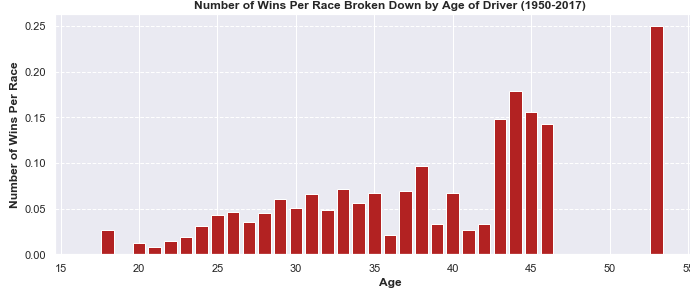
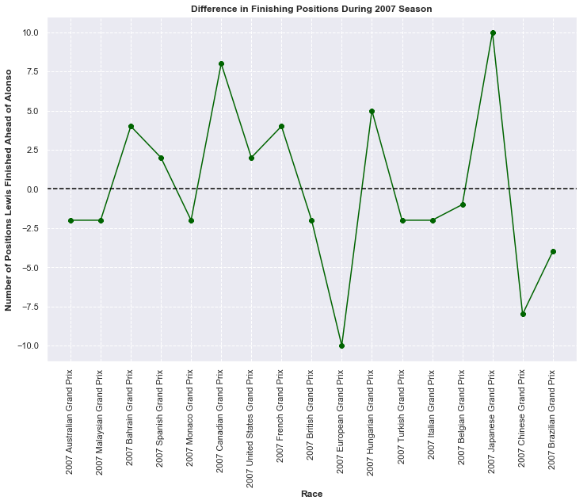
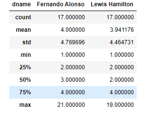

# Maxim's Portfolio
Portfolio of various data-oriented projects!

# [Project 1: Formula-1-Analysis](https://github.com/mguzman123/Formula-1-Analysis)

## Background
F1 aka Formula 1 is an international racing series that currently involves ten different teams, each with two drivers. The number of teams have varied across the years as Formula 1 dates back all the way to 1950. Some of the teams, called "constructors", are familiar to the general population through their production of commercial cars. These include Ferrari, Mercedes, McLaren, and Renault. Each race is known as a Grand Prix and the location of these races have changed (and will continue to change) over time. 

The series works though a point system with the current system awarding points to the top 10 drivers; and the closer to first you finish, the more points you receive. It is important to note that the point system has changed since 1950; regardless, the driver with the most points in the end of the season is considered the world champion. There is also a chance for there to be the best constructor which is awarded to the team who has scored the most points at the end of the season. 

## Project Overview
In this project, we take a look at the 2007 season and focus on a single constructor: McLaren. The two drivers in this year were Lewis Hamilton (from the UK) and Fernando Alonso (from Spain). We take the point of view as a potential sponsor for one of the drivers in the 2008 season but want to decide which person to choose. 

This project is approached with the point of view of a potential sponsor for McLaren F1 racing team following the 2007 Formual 1 World Championship. We look at different metrics that measure each drivers performance in the 2007 season to determine who drove at a higher level/has the most potential and therefore who we want to sponsor in 2008. We want to select the best performing individual in order to maximize our ROI since the better driver will gain more exposure which will help advertise our brand. This [article](https://drivetribe.com/p/who-benefits-the-most-from-f1-sponsorship-QjpzASLyTl6D-sfxRsiSkw?iid=Ht3q7xAnRPOjuRcfGCIuoA) provides more in-depth background on sponsorship in F1.

I obtained this data from Kaggle, which can be found [here](https://www.kaggle.com/rohanrao/formula-1-world-championship-1950-2020)

## Data Cleaning

This mostly consisted of flagging outliers, setting place holders for missing values, checking consistency between related variables, and renaming columns. After the files were cleaned, I used SQL to join relevant fields from different tables and then made some final changes, which can be seen in the first four notebooks.

## Summary of Analysis

Below is a high-level summary of the analysis conducted to choose the driver to sponsor. The complete analysis can be found in [this notebook](https://github.com/mguzman123/Formula-1-Analysis/blob/main/notebooks/05_01_hamilton_alonso_analyze.ipynb)

### Age in Formula 1 

Alonso is older than Hamilton and this is actually Hamilton's rookie season so it's not exactly an apples to apples comparison. We can take a look at the relationship between age and performance.

### Qualifying/Grid Positioning 

The first, main part of the a grand prix weekend is qualifying. This is arguably the most important portion of a grand prix weekend since it determines where the driver will start on the rack. The farther up the line you start, the less you have to fight other drivers to gain positions, which allows for more efficient driving. Therefore, if a driver has better qualifying laps, the higher the chance of them winning the race and gaining more points; and we want to sponsor the most successful driver.

The way qualifying works is that, in the first round, the slowest five drivers are eliminated and hold positions 16-20. In the second round, the next five slowest drivers are also disqualified and hold positions 15-11. In the third, final qualifying round, the last 10 drivers fight for pole (first) position. A drivers grid positioning (starting position) is directly determined by qualifying.

Hamilton began ahead of Alonso in 10 out of 17 times which conveys him as a better driver in this metric; and someone the sponors can expect to, accordingly, deliver better results. We can also confirm that, the farther up the line a driver starts, the more likely they are to win the race.

### Lap by Lap Consistency in Race

One way to measure the skill of their driver is their ability to perform consistently. 

Hamilton had more consistent laps in 9 out of 17 races while Alonso was more consistent in 7 out of 17 races. Hamilton slightly outperforms Alonso in this metric which gives him some favor in terms of receiving a sponsorship.

### Driver Performance Capabilities

The two teammates drive identical vehicles so any discrepancies in lap times truly come down from the innate abilities of each driver. Obviously, we want to sponsor the driver who has more inherent talent.

Alonso barely outperforms Hamilton in terms of fastest lap speed, where he was able to push the car faster in 9 out of 17 races. Conversely, when looking at median lap times, Hamilton is faster in 9 of the races (they have equivalent times for the first race). These findings make it a bit difficult to judge who truly has more talent; although, the faster median lap times indicates the ability for Hamilton to deliver consistent results.

### End of Race Wins, Podiums, and Points

Somehow, both Hamilton and Alonso had identical stats in terms of number of wins, podiums, and points. However, we can run a more in-depth analysis to extract and subtle distinctions.

Alonso scored more points than Hamilton did in the majority of races, indicating that he's more consistent. However, Hamilton's median points were higher. Overall, Alonso seems to be a bit superior in this realm and he comes across more dependable. This, as mentioned before, is important to us sponsors; we don't want a driver who will be all over the place. We want someone we can count on day in and day out.

As expected, Alonso finished ahead of Hamilton ten times, which is what we saw with the points comparison. Yet, Hamilton put up more favorable statistics here. So, once looking at the nuances, Hamilton is more talented in terms of finishing position. As Hamilton has mostly performed better in previous metrics, this eases the sponsorship decision slightly.

Hamilton better maintained his grid positioning throuhgout the race to the end of race, which exemplifies stability. Meanwhile, Alonso exceled in battling other drivers for better positioning. The latter is probably more important since it shows his ability to improve and outperform other drivers.

### Final Comparison

Hamilton outperformed Alonso in qualifying, grid positioning, driving consistency, lap time performance, and final positioning. Alonso was supeior in lap speed performance, points earned, and improving positioning from the beginning of race.

### Sponorship Choice

Even though Hamilton was the better driver more often, we have to remember it was never a landslide. Furthermore, while it's very difficult to come with exact numbers, each criterion don't carry the same weights. For instance, Alonso's ability to gain more positions throughout a race is probably more valued than Hamilton's ability to defend his position.

However, we do have to remember that this is Hamlton's rookie season while Alonso has been around for a few years. We saw that drivers do tend to perform better with more experience.

Therefore, Hamilton does seem to have more potential as a driver as he is already peforming at the same level as Alonso and hasn't had any previous experience in F1. Taking this and all the other analyses into account, as a sponsor, Hamilton sounds like the better choice and the driver we plan to sponsor in the 2008 season

### References

1. [Wikipedida French Grand Prix](https://en.wikipedia.org/wiki/2007_French_Grand_Prix)
2. [Wikipedida Hungarian Grand Prix](https://en.wikipedia.org/wiki/2007_Hungarian_Grand_Prix)
3. [Wikipedida F1 World Championship](https://en.wikipedia.org/wiki/2007_Formula_One_World_Championship)
