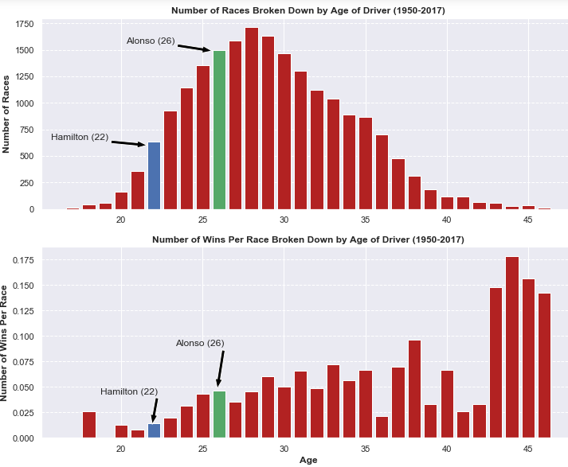
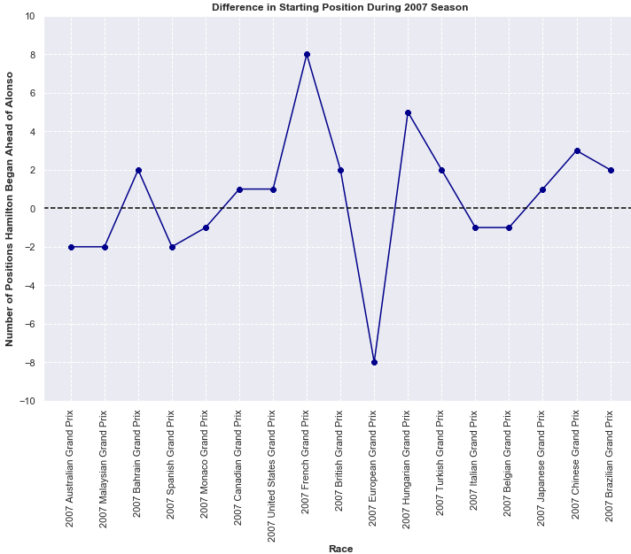
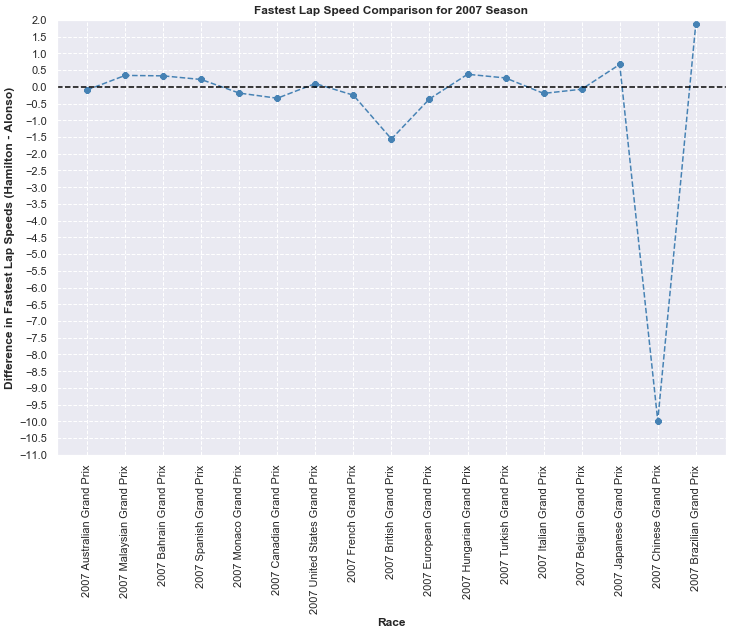

# Maxim's Portfolio
Portfolio of Data Projects

# [Project 1: Formula-1-Analysis](https://github.com/mguzman123/Formula-1-Analysis)

## Background
Formula 1 (aka F1) is an international racing series that currently involves ten different teams, each with two drivers. The number of teams has varied across the years since Formula 1 started in 1950. Some of the teams, formally called "constructors", are familiar to the general population through their production of commercial cars. These include Ferrari, Mercedes, McLaren, and Renault. Each race is known as a Grand Prix and the location of these races have changed (and will continue to change) over time. Currently, in 2020, there are 10 teams in Formula 1 who participate 17 races.

Determining the winner of the annual series works through a point system. The current system awards points to the top 10 drivers; the closer you finish to first, the more points you receive. It is important to note that the point system has changed over the years so you can't (always) directly compare the total points a driver earned one season to those earned by a driver in another season. Regardless, the driver with the most points at the end of the season is the world champion. There is also the competition for best constructor, which is awarded to the team who has scored the most points at the end of the season. 

The structure of a F1 weekend is as follows. First is Friday practice where drivers have two 90-minute opportunities (once in the morning and once in the afternoon) to familiarize themself with the track. On Saturday morning, the third and final practice session takes place for an hour and this is followed by qualifying in the afternoon. This afternoon session lasts about an hour and is split into 3 sessions: Q1, Q2, Q3. In the first qualifying session (Q1), all 20 drivers race on the track at the same time and the five slowest drivers are eliminated. They fill positions 16-20 in the actual race, corresponding to when they finished in this qualifying round. In Q2, the remaining 15 cars all race simultaneously and the slowest 5 cars are once again eliminated. These 5 drivers take positions 15-11, with their positions analogous to how they finsihed in Q2. Finally, in Q3, the remaining 10 drivers compete for pole (first) position and the fastest driver takes this position. They will start in first place on the grid when the race starts the following day. Sunday is the day of the actual race where all drivers compete for podiums (top 3 placement). You can read more about the Grand Prix format [here](https://www.tutorialspoint.com/formula_one/formula_one_grand_prix_format.htm).

## Project Overview
In this project, I act as a potential sponsor for a driver in the 2008 season by reviewing the peformance of the 2007 McLaren drivers. The two drivers in this year were Lewis Hamilton (from the UK) and Fernando Alonso (from Spain). We have to make the difficult decision of deciding who would be the best to choose. An F1 driver since 2001, Alonso has defeated many of his teammates throughout his career and performed exceptionally well, even when driving poorly-engineered cars. Hamilton, a rising star from the GP2 (a former F1 feeder), world has a lot of potential and his rookie season will set the bar for future sponsorships.

To select which driver to sponsor, we look at different metrics that measure each drivers' performance in the 2007 season to determine who drove at a superior level and has the most potential. We need to select the best performing individual in order to maximize our ROI since the better driver will gain more exposure and maximize the visibility of our brand. This [article](https://drivetribe.com/p/who-benefits-the-most-from-f1-sponsorship-QjpzASLyTl6D-sfxRsiSkw?iid=Ht3q7xAnRPOjuRcfGCIuoA) provides more in-depth background on sponsorship in F1.

I obtained this data from Kaggle, which can be found [here.](https://www.kaggle.com/rohanrao/formula-1-world-championship-1950-2020)

__Disclaimer__: If this was a real-life situation where a lot of money was at stake, we would want to look beyond just one season in order to account for any anomalies that occur in a single season. I chose 2007 because I wanted to analyze Hamilton's rookie season verses Alonso's 7th season and compare how two of most well-known drivers in F1 today stack against each other during Hamilton's first season in F1.

## Data Cleaning

Data Cleaning mostly consisted of flagging outliers, setting place holders for missing values, checking consistency between related variables, and renaming columns. After the files were cleaned, I used SQL to join relevant fields from different tables and then made some final changes, which can be seen in the first four notebooks.

## Summary of Analysis

Below is a high-level summary of the analysis conducted to choose which driver to sponsor. The __complete analysis__ can be found in [this notebook](https://github.com/mguzman123/Formula-1-Analysis/blob/main/notebooks/05_01_hamilton_alonso_analyze.ipynb).

### Age in Formula 1 

Alonso is four years older than Hamilton and has been around several years longer than the rookie. Because Alonso is older and more experienced, it is more likely that drivers around his age perform better than those around Hamilton's age.

### Qualifying/Grid Positioning 

To assess who performs better in qualifying, we can observe their starting grid positions. As stated in the background, qualifying directly influences a drivers grid positioning. A driver outperforms his teammate in this section if they begin ahead of that teammate. Our choice of who to sponsor will take into account whether Hamilton or Alonso has better qualifying laps and a higher grid position. 

In the graph above, grid positioning is directly influenced by qualifying. The better one qualifies, the farther towards the front they'll start and the better they'll finish at the end of the race. This highlights the significance of qualifying well.

Alonso and Hamilton always start in the top 10, meaning they consistently have a fighting chance for a podium position (the [complete notebook](https://github.com/mguzman123/Formula-1-Analysis/blob/main/notebooks/05_01_hamilton_alonso_analyze.ipynb) goes into detail about the events leading up to grid positioning). Alonso begins in the top 5 in 15 races and Hamilton begins in the top 5 in 16 races. The closer to first you are, the more significant a position difference is when it comes to winning. Therefore, any time one McLaren driver begins ahead of the other is very important.

Overall, throughout the course of the season, Hamilton starts 10 positions ahead of Alonso. While both drivers are very fast, Hamilton is slightly, and critically, able to edge out Alonso in the end.

### Lap by Lap Consistency in Race

Here, we're going to focus on how often a driver deviates from his position on a lap-by-lap basis. We'll specifically be looking at the standard deviation of their positioning throughout each race. The smaller the standard deviation, the less their position varies, which is what we want. Since the two McLaren drivers (nearly) always begin toward the front of the pack, they only have a few positions to gain while simultaneously having many positions to lose. Therefore, even if they improve and move towards podium/pole position, this will likely be a small change from their initial positioning, while them dropping down over 10 positions will be a large contrast. The latter will produce larger standard deviations.

Looking at the standard deviation visualization, we see that Hamilton has more consistent lap positions in 9 out of 17 races. Meanwhile, Alonso has a smaller standard deviation in 7 out of 17 races. There are some events (explained in the [full notebook](https://github.com/mguzman123/Formula-1-Analysis/blob/main/notebooks/05_01_hamilton_alonso_analyze.ipynb) ) that affect each drivers' lap positioning in various races. To quickly summarize, Alonso faces issues that are more connected to his driving while Hamilton encounters adversity outside of his control. As a result, Hamilton is depicted as the more proficient driver and, once again Hamilton is a more favorable choice to potential sponsors.

### Driver Performance Capabilities

This next section explores how much performance each driver can extract from the car. The two vehicles are identical from an engineering standpoint and any differences in speed come from the skill of the driver itself. This is a great way for a sponsor to get an idea of which driver can push the car to its maximum capabilities. Here, we'll explore each drivers' top speeds and lap times. Clearly, faster lap speeds and shorter lap times indicate more innate skill in the driver.

Alonso barely defeats Hamilton in the fastest lap speed criteria, where he is able to push the car faster than Hamilton in 9 out of 17 races. However, with the exception of a few races, the drivers are neck-and-neck, usually within half a km/hr of each other. In the Chinese Grand Prix, Hamilton faces some tire and pit stop issues and has to retire from the race. Overall, Alonso is faster by about 4.6 km/hr throughout the whole season.

Both Hamilton and Alonso have equivalent median lap times for the first race of the season. Beyond that, Hamilton has a quicker median lap time in 9 out of 16 races. Furthermore, the net difference favors Hamilton by about 2.8 seconds. For the most part, when Hamilton is faster than Alonso, he's significantly faster. In contrast, Alonso rarely dusts his teammates when he is the quicker driver.

Each driver had an opportunity to shine in each category and this puts them head-to-head in pure driving skill.

### End of Race Wins, Podiums, and Points

Somehow, both Hamilton and Alonso have identical stats in terms of number of wins, podiums, and points in the 2007 season. However, we can run a more in-depth analysis to extract any subtle distinctions.

Out of the 10 races Alonso finishes ahead of Hamilton, he manages to make the margin over 2 points in 3 of the races. We'll take a closer look in the next section, but this means that Alonso only finishes one or two position ahead of Hamilton - usually 1st vs 2nd/2nd vs 3rd. In contrast, in the 7 races Hamilton finishes better than Alonso, he scores over two points more than Alonso in 5 of them. Thus, while Hamilton is less frequent in winning more points, he increases the point margin to a greater extent.

Overall, Alonso is a slightly more skilled driver in terms of points won as he outperforms Hamilton more often. This paired with the smaller variation in points illustrates that he is a more dependable driver. However, we mustn't discount Hamilton's ability to stand out more when he does dominate.

When it comes to final positioning, we can see that Alonso, again, finishes ahead of Hamilton 10 times. This is consistent with what we saw in terms of how often Alonso scores more points than Hamilton. 

However, Hamilton supplies some more favorable statistics here. On average, he finishes closer to pole position than Alonso, though barely. Hamilton's median position is one ahead of Alonso's and he actually deviates less in ending positioning too. Accounting for the two unfortunate races each driver faced where they finish far outside the top 10, Hamilton tends to finish one position ahead of Alonso when looking at the median. Also, across all the races, Hamilton finishes one position ahead of Alonso, displaying dominance in this metric.

Finally, we measure the skill of these drivers by seeing how much they improve and/or decline from the start of the race to the end of the race. To do this, we look at where they finish compared to where they begin on the grid. This displays the drivers' ability to battle others for better positioning while also defending their current position.

Since both McLaren drivers tend to start towards the front of the pack, they only have a few positions to gain while having many positions to lose. Hamilton starts at pole position six different times and finishes first as well in four of these races. One of the two races where he failed to finish first was in China where he was forced to retire. 

While it seems that Alonso is more skilled in battling other drivers for positioning, he starts the race behind Hamilton in six of the eight instances he does gain positioning. Also, out of these eight races, he starts in 4th place three times, 6th place once, 10th place one, and finally 2nd place once. Meaning, he typically has a few drivers from the very beginning ahead of him, allowing for improvement. 

Overall, Hamilton is better in maintaining the same position he held when the race began. Alonso, on the other hand, shows his ability to improve positioning when starting farther back. Given the context of grid positioning, Hamilton's statistics in this case are more impressive since he already starts towards the front and the graph shows very little change, which is what we want for drivers in this case.

### Final Comparison

Hamilton outperforms Alonso in qualifying, grid positioning, driving consistency, lap time performance, final positioning, and maintaining dominant positioning throughout a race. Alonso is superior in lap speed performance and points earned.

### Sponsorship Choice

Even though Hamilton was the better driver more often, we have to remember it was never a landslide in the 2007 season. Furthermore, while it's very difficult to come up with exact numbers, each criterion doesn't carry the same weights. Finally, as we touched on before, we don't have a robust amount of data; ideally we analyze more data points to come to a more solidified conclusion.

In addition, this is Hamilton's rookie season while Alonso has been around for a few years. We saw that drivers do tend to perform better with more experience.

Therefore, Hamilton has more potential as a driver as he is already performing at the same level as Alonso, a 2x world champion. Taking this and all the other analyses into account, as a sponsor, Hamilton is the better choice and the driver we plan to sponsor in the 2008 season.

### References

1. [Forumla One World Champinshiop](https://en.wikipedia.org/wiki/2007_Formula_One_World_Championship)
2. [French Grand Prix](https://en.wikipedia.org/wiki/2007_French_Grand_Prix)
3. [Hungarian Grand Prix](https://en.wikipedia.org/wiki/2007_Hungarian_Grand_Prix)
4. [Chinese Grand Prix](https://en.wikipedia.org/wiki/2007_Chinese_Grand_Prix)
5. [Canadian Grand Prix](https://en.wikipedia.org/wiki/2007_Canadian_Grand_Prix)
6. [European Grand Prix](https://en.wikipedia.org/wiki/2007_European_Grand_Prix)
7. [Japanese Grand Prix](https://en.wikipedia.org/wiki/2007_Japanese_Grand_Prix)
8. [Brazilian Grand Prix](https://en.wikipedia.org/wiki/2007_Brazilian_Grand_Prix)
